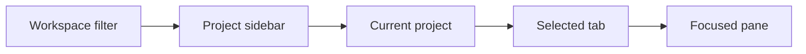

# App model

The desktop and keyboard TUI are clients of the same server. The
[product model](./product-model.md) defines what clients own; this document
defines how users navigate and manage their views.

## Clients and servers

The desktop bundles the same `muxy` CLI/TUI and `muxy-server` executables
provided for standalone use. Either client connects to the server on its
machine, starting it if needed. Remote connections are deferred; users can
already SSH to another machine and run `muxy` there.

The model allows clients to organize several servers later. A project routes
to its `server_id`, and its panes inherit that route. Changing projects may
therefore change the responsible server. There is no global active-server
selection or sidebar server selector. Servers are managed in Settings, with
the current device selected by default.

## Layouts and restoration

Desktop and TUI keep separate layouts and workspaces while sharing access to
server projects and sessions. Several TUI instances can open the same saved
TUI layout concurrently; layout changes need not appear live in another
instance. Opening an existing session adds it to the client's layout; sessions
from another client are discoverable within their project.

On launch, desktop restores every project, its tabs, and window view state. It
never creates a tab automatically. The TUI's first launch opens one shell in
Home; later launches restore its saved project and layout.

The desktop currently opens one workspace window and a reusable Settings
window. Multiple workspace windows, including the same project in two windows,
and side-by-side tab layouts may be added later without changing ownership.

## Navigation and focus

The sidebar defaults to **All projects**, listing each top-level project once.
A workspace filter restricts that list to its members; Home always stays first.
One user-defined top-level order applies under every filter. Worktree children
appear beneath their parent. Selecting a top-level or worktree project changes
the current directory context and visible tab set. Filtering never changes
project ownership or execution context.

The current project, selected tab, and focused pane belong to the window.
There is one active pane for the whole window, even if several tabs are visible.
A tab displays that pane's title when it contains the active pane, otherwise
its first pane's title.

Closing the active pane focuses an adjacent pane in its tab. Closing the whole
tab focuses the first pane of the next tab, or the previous tab if there is no
next tab. Closing an inactive pane or tab never steals focus. Normal tab
selection may restore a pane from the window's focus history.

## Disconnected and ended sessions

An unreachable server leaves the project loaded and app-only panes usable.
The bottom status bar shows disconnection with a connect action; healthy
connections need no indicator. Terminal panes retain their last available
content. Existing project edits and closes remain available while disconnected
and replay in order on reconnection.

An ended terminal pane stays open, marked as exited, and accepts no input.
Its saved screen and history remain available for scrolling, search, selection,
and copy, including after relaunch. Missing saved content is explained in the
pane. An ended or discarded session is never automatically restarted. See the
[server model](./server-model.md#closing-panes) for close and retention rules.

Quitting or detaching leaves sessions running. **End All Sessions and Quit**
ends all live sessions on the current-device server and clears terminal panes
and their saved content before quitting. App-only panes remain, including in
mixed tabs.

## Settings window

Settings is one reusable app-level window, separate from project tabs. It
remains available while disconnected and never changes project, tab, or pane
selection. It uses the active theme, searchable categories, and controls that
apply changes immediately without relaunching.

App preferences live in `settings.toml`, terminal preferences in `ghostty.conf`,
and custom themes in `themes/`. Keyboard shortcuts share one overridable action
system, including contexts and aliases for app actions, fields, menus, pickers,
and buttons. Ordinary terminal keystrokes remain terminal input.

Server settings apply to the selected server. Stopping or restarting it requires
confirmation. Existing saved settings panes are removed on restore without
affecting neighboring terminal panes or sessions.

## App updates

Compatible app updates preserve running sessions. The bundled server is
replaced when all sessions end, including idle shells and detached sessions.
Server settings show pending server updates.

An incompatible beta update may wait for all sessions to end. This schedules
installation and app restart while the app runs; users can cancel it. Updating
immediately requires confirmation that all terminal processes on the device
will end. Tabs and saved output remain.
