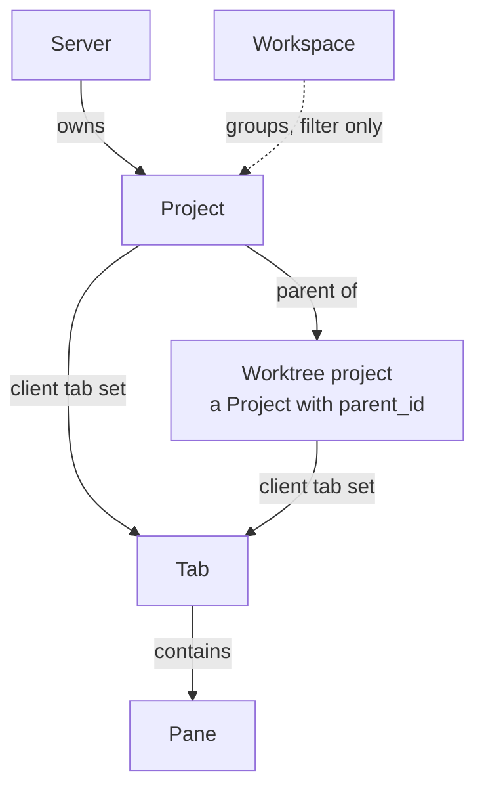
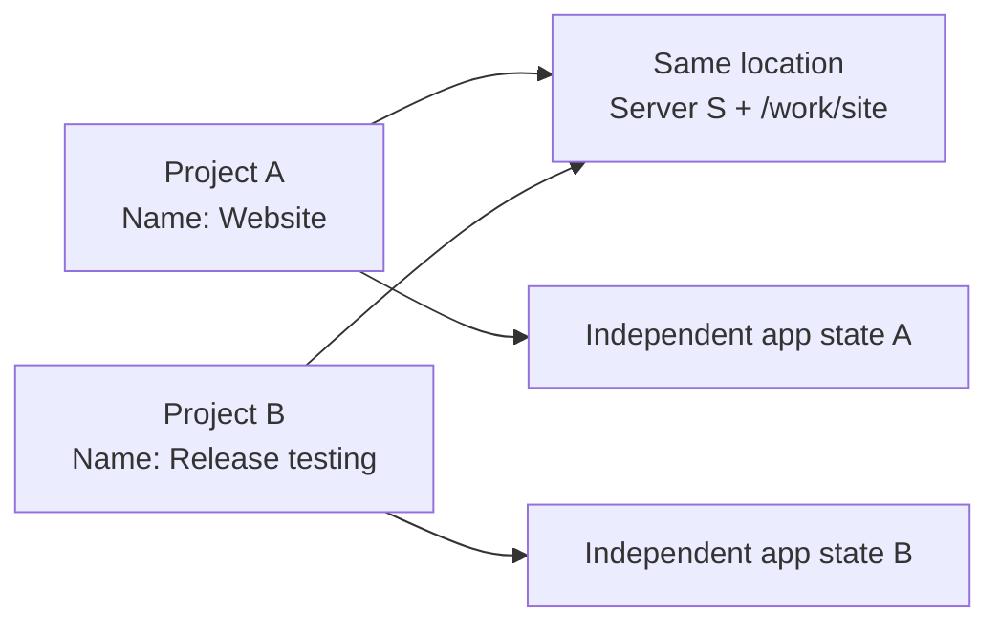
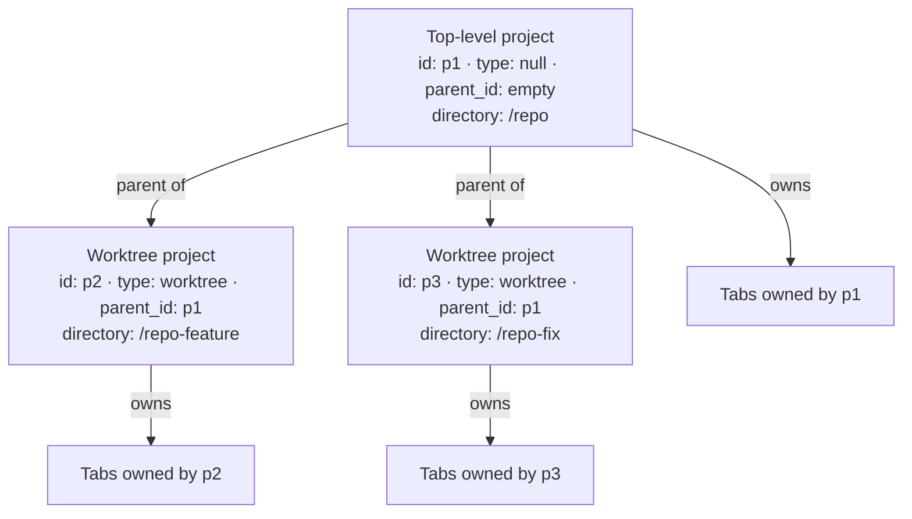

# Product model

This document defines the stable concepts in Muxy and which concept owns each
piece of user state.

## Relationships

The cardinalities are intentional:

- Every project belongs to exactly one server; each server has a Home project.
- A workspace may contain any number of ordinary top-level projects, and an
  ordinary top-level project may belong to any number of workspaces.
- A project may have any number of child projects. Git worktrees are the first
  defined child-project type.
- Each client keeps its own tabs and pane layouts for each project.
- Every tab contains at least one pane, and every pane belongs to exactly one
  tab.
- A terminal pane references one session explicitly owned by its project.
  Sessions are defined in the [server model](./server-model.md).

## Invariants

- A project with `type = worktree` must have a `parent_id`.
- A project with `type = worktree` cannot be a parent. Nesting depth is one.
- A worktree project has the same `server_id` as its parent.
- A tab always has at least one pane.
- Each server has one Home project. It cannot be deleted or have child projects.
- Workspaces contain only ordinary top-level projects. Neither worktree
  projects nor the Home project belong to a workspace.

## Identity and location

A project is identified by a generated project ID. Its server and directory
describe its location, but do not define its identity.

| Project information | Purpose |
| --- | --- |
| Generated ID | Stable server-owned identity |
| Name, icon, and color | Shared server metadata, editable by clients |
| Server and directory | The location where project work happens |
| Nullable `type` | Optional specialized behavior; `worktree` is the currently defined value |
| Nullable `parent_id` | Generic relationship to another project |
| Workspace memberships | Client-owned organization for top-level projects |
| Tab and pane state | Each client's independent working state for the project |

A new project's name defaults to its directory name, its color is assigned
automatically, and its icon is an optional emoji. Editing these fields in one
client updates the project for every client.

Two projects may therefore point to the same server and directory. In that
case:

- the underlying files and Git state are naturally shared because the location
  is shared;
- each project has independent name, icon, and color shared across its clients;
- each client keeps independent workspace memberships, tabs, and pane layouts;
- neither project is treated as an alias or canonical copy of the other;
- each may register the same Git worktree as its own worktree project, and
  those worktree projects also remain independent.

## Home project

Each server has one top-level Home project pointing at that server user's home
directory. It owns Quick Terminal and other ad-hoc sessions. It cannot be
deleted or have worktree children. Clients keep their own Home tabs and panes,
including app-only panes. A remote server never reuses the local Home identity
or path. There is therefore never a server with zero projects.

## Workspaces and project discovery

Workspaces are client-owned overlapping collections and may group projects
from several servers. Memberships are not shared with other clients.

- The default sidebar view is **All projects**, containing only projects whose
  `parent_id` is empty.
- A workspace filter shows top-level projects that belong to that workspace.
  The Home project is listed regardless of the active filter.
- A top-level project in several workspaces still appears only once in **All
  projects**.
- A top-level project may be ungrouped, and a workspace may be empty.
- Worktree projects are reached through their parent project rather than shown
  as top-level sidebar entries.
- Top-level projects keep one user-defined order that applies under every
  filter. The Home project stays first.
- Filtering the sidebar never changes project ownership or execution context.

## Top-level and typed child projects

There is no separate Worktree entity. A Git worktree is another project record
using the generic project type and parent relationship:

- An ordinary top-level project has a null `type` and an empty `parent_id`.
- The top-level project's directory is the main working directory, whether the
  project uses Git or not.
- An additional Git worktree sets `type = worktree`, sets `parent_id` to its
  top-level project's ID, and stores its own worktree directory.
- A worktree project uses the same server as its parent because both directories
  belong to the same server-side project context.
- A project with `type = worktree` must have a `parent_id` and cannot itself be
  a parent. The generic `parent_id` field is not otherwise limited to
  worktrees, allowing other child project types to be defined later.
- A non-Git project remains a top-level project without an implicit child
  record.
- A worktree project is created in the app from a branch and a directory, which
  creates the Git worktree, or registered from a Git worktree that already
  exists. Its name defaults to the branch name and its color to its parent's.

The sidebar shows top-level projects and lists each one's worktree projects
beneath it by matching `parent_id` to the top-level project's ID.

## Failed state

A project's existence depends on its path. A project whose directory no longer
exists on its server loads in a failed state. A worktree project additionally
requires its Git worktree to exist; if either the path or the Git worktree is
missing, it loads in a failed state as well.

In the failed state the only allowed action is deleting the project. A server
that is stopped or unreachable does not put a project into the failed state;
see the app model for how panes behave in that case.

## Deletion

- Deleting a project removes it from the server and every client and ends all
  its terminal sessions, including those displayed elsewhere. Confirmation
  explains this impact. Its directory and files remain untouched.
- Deleting a worktree project prompts the user to either also delete the
  worktree path and Git worktree, or leave them orphaned on disk.
- Deleting a top-level project deletes its child projects and all of their
  tabs. Their paths and Git worktrees are never touched.
- Deleting a workspace does not affect any project.
- The Home project cannot be deleted.

## Tabs and panes

A tab belongs to one client's view of a project and owns one or more panes.
The project may be a top-level project or a worktree project. A tab has no title of its own; it
displays the title of the window-focused pane when it contains that pane,
otherwise its first pane.

Panes are arranged by splitting an existing pane horizontally or vertically, at
any depth, and the arrangement is saved with the tab. A project may have no
tabs; the desktop never creates one on its own. The TUI's first launch opens
one shell in Home and thereafter restores its own project and layout.

Panes are typed. A pane type is either **app-only** or **server-bound**:

- app-only panes, such as a web view, do not depend on a server;
- server-bound panes, such as a terminal or an extension view that executes on
  a server, inherit the owning project's server and directory context and
  reference a session on that server.

Pane content may include:

- terminal (server-bound);
- web view (app-only);
- extension-provided view (either, depending on the extension);
- future pane types.

The first release supports terminal panes and a separate app-level Settings window.

A terminal pane offers what a standalone terminal such as Ghostty offers,
including selection and clipboard, search, links, mouse reporting, input
methods, and shell integration. Its title is the title set by the program
running in it, otherwise the name of its foreground process, otherwise its
current directory. Shell integration enables jumping between prompts and
selecting a command’s output without selecting its prompt. It can be disabled
in the server’s settings.

The window has one active pane. That pane provides its tab's displayed title;
focus is window state, not tab state, even when several tab layouts are visible.
A new terminal pane starts in the owning project's directory or, when a
setting says so, in the current directory of the pane it was split from.
Changing a terminal's current directory affects that terminal process only; it
does not change the session's explicit project membership. Closing a terminal
pane detaches it. The session ends only when no other open pane in a connected
client uses it, including inactive tabs. Before ending a foreground program
other than the shell, the user confirms once first. Background jobs alone
do not trigger confirmation. Ordinary shell jobs follow normal terminal exit
behavior; independently detached work is not targeted. When a session's process exits, or the app finds on
reconnect that the session no longer exists, its pane stays open, marked as
exited, with its last saved screen and retained history. This content remains
available for scrolling, search, selection, and copy, including after relaunch.
Closing the final connected pane also discards the session’s saved content.
Closing the last pane in a tab closes the tab.

Panes and tabs do not move between containers in this version; tabs may only
be reordered within their project. Nothing in the model prevents movement from
being added later.
