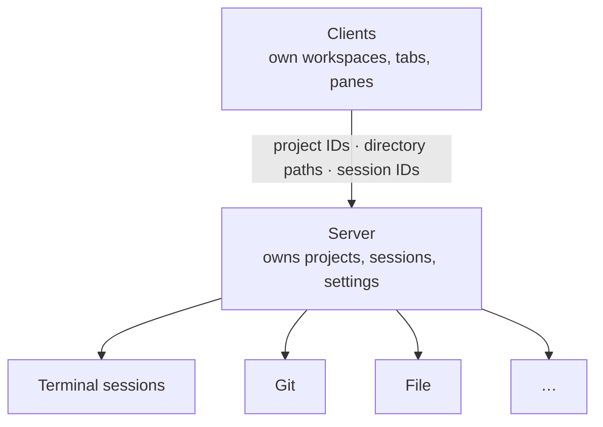
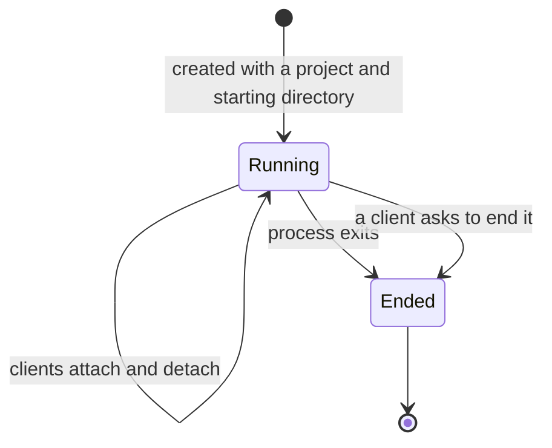

# Server model

This document defines what a server is, what it owns, and the capabilities it
provides to desktop and terminal clients. The technical design defines
communication and the mechanics of running terminals.

## Role

A server owns projects, shared project metadata, terminal sessions, and its
settings. It keeps terminals alive on its own; desktop and terminal clients
attach and detach independently.

- The server owns project identities, directories, names, icons, colors, and
  parent relationships. Each server has one protected Home project.
- Workspaces, project order, tabs, panes, selection, and focus belong to clients.
  Project metadata changes and deletions reach every connected client.
- Every terminal session belongs to exactly one project. Creation specifies
  its project and starting directory; the directory never determines ownership.
  Quick Terminal and ad-hoc sessions belong to Home.

## Lifecycle

- A server runs as its own process, separate from the app, which is what lets
  sessions outlive the app.
- The separate `muxy-server` executable is bundled with the desktop and
  distributed with the `muxy` client. Clients start it if needed. It keeps
  running until stopped or
  replaced for a pending update after all sessions end. Connections are local
  in this phase; a user may SSH to another machine and run `muxy` there.
- Stopping or restarting a server ends every session it owns. Its settings
  and saved terminal content survive; saved content never restarts a process.
  After an abrupt stop, output since the last saved checkpoint may be lost.

## Sessions

A session is a running terminal process owned by one server project and
identified by a server-generated ID. A terminal pane holds that session ID.
Clients may use different layouts to display the same session.

- A session runs until its process exits or a client ends it. Attached clients
  do not matter: closing the app, an app crash, or the device sleeping leave
  it running, and the server never ends or expires a session on its own.
- Any number of clients may attach at the same time. All receive the same
  output and may send input; resolving size conflicts is deferred.
- On attach, a client receives the current screen and a recent window of
  history. Older history is available in further pages until the retention
  limit is reached. The server saves the last screen and retained history,
  even while no app is connected. After the process ends, this content stays
  available by session ID until a client explicitly discards it. Ending a session
  does not shrink the history that was retained while it was live.
- Live-session lists retain their existing meaning. Project session lists
  distinguish live processes from retained ended content.
- Project deletion ends its sessions and discards their saved content across
  clients. Its directory is never removed.
- When a server is unreachable, its sessions are unreachable, not necessarily
  ended. See the app model for how panes behave.

## Capability areas

The diagram shows areas, not a fixed list. Terminal sessions are defined
above. Git provides worktree management: listing worktrees, creating one from
a branch and a directory, and removing one. File operates on paths; its scope
is defined in a future phase. Further capabilities may be added.
